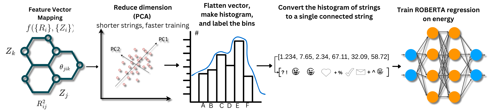

# Chemical feature vectors for LLMs

Team "geometric-geniuses"
Contribution for 24' LLM Hackathon for Applications in Materials and Chemistry

Video explanation

https://www.youtube.com/watch?v=WZz1pVRS4RA&t=5s




# Setup
Create a new conda environment. Then install all requiered dependencies with the following command:
`pip install  .`


# Running the code

## Tutorial

Check out the jupyter notebook file `tutorial.ipynb`.


## Create input data from MD17 dataset of small molecule MD trajectories

First change to the main directory

`cd Feat2LLM`

then

`python load_data.py --do_small --n_components 10`

Afterwards you will get files in the `data` folder with the following names:

```
rep_aspirin.pkl
rep_benzene.pkl
rep_ethanol.pkl
```

## Fine-tune the model roberta-base

`python roberta_finetuning.py --small True --data ethanol --rep cMBDF`

## Evaluate the model's performance

`python eval_roberta.py --small True --data ethanol --rep cMBDF`
